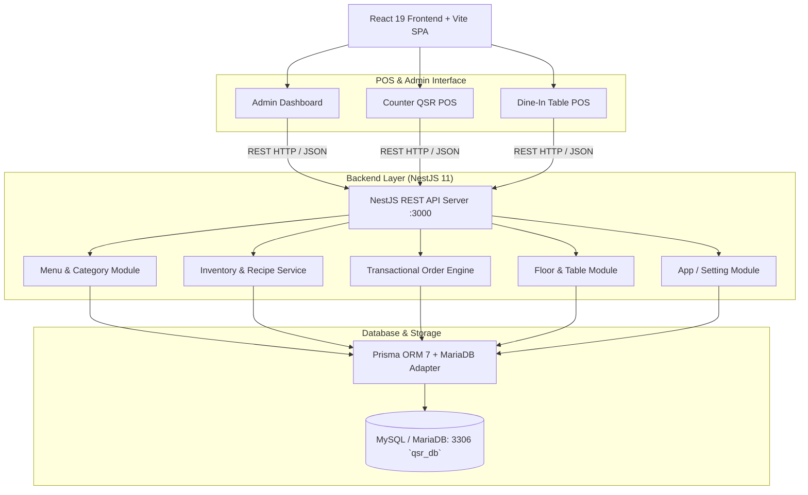
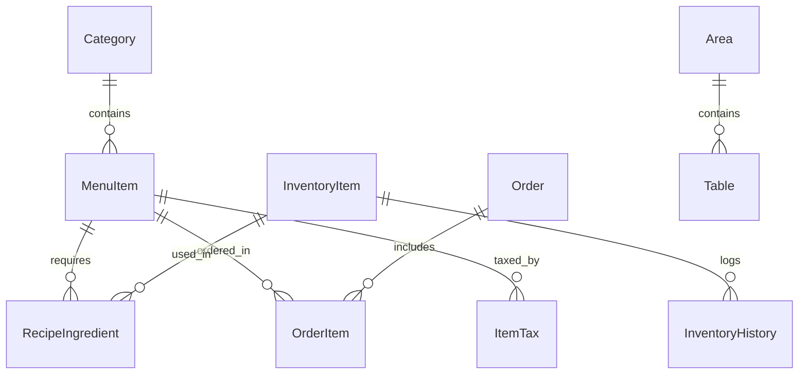

# 🍽️ QSR & Restaurant Management POS System

[](https://nodejs.org/)
[](https://nestjs.com/)
[](https://react.dev/)
[](https://www.typescriptlang.org/)
[](https://vitejs.dev/)
[](https://www.prisma.io/)
[](https://mariadb.org/)

A full-stack, enterprise-grade **Quick Service Restaurant (QSR) & Dine-In Management System** built with **NestJS**, **React 19**, **TypeScript**, **Prisma ORM**, and **MySQL/MariaDB**.

The platform provides an end-to-end solution for modern food businesses, featuring real-time POS terminals (Counter & Table dine-in), automated recipe-based inventory deduction, floor and table management, menu engineering, and analytical dashboards.

---

## 📑 Table of Contents

- [✨ Key Features](#-key-features)
- [🏗️ System Architecture](#️-system-architecture)
- [💻 Tech Stack](#-tech-stack)
- [🗄️ Database Schema & Models](#️-database-schema--models)
- [🛠️ Required Tools & Prerequisites](#️-required-tools--prerequisites)
- [🚀 Installation & Setup Guide](#-installation--setup-guide)
  - [1. Database Setup](#1-database-setup)
  - [2. Backend Setup](#2-backend-setup)
  - [3. Frontend Setup (Admin Panel & POS)](#3-frontend-setup-admin-panel--pos)
- [🖥️ How to Run & Access the System](#️-how-to-run--access-the-system)
- [📡 API Documentation](#-api-documentation)
- [📁 Project Directory Structure](#-project-directory-structure)
- [🔧 Helper Scripts & Maintenance](#-helper-scripts--maintenance)
- [❓ Troubleshooting & FAQs](#-troubleshooting--faqs)

---

## ✨ Key Features

### 1. 📊 Executive Admin Dashboard
- **Live Sales & Performance Metrics**: Real-time tracking of daily orders, revenue, active tables, and comparison trends vs. previous days.
- **7-Day Revenue Analytics**: Interactive visual bar charts showing weekly revenue distribution.
- **Recent Activity Stream**: Live feed of incoming orders and transaction values.
- **Quick Actions**: One-click shortcuts for rapid item addition, stock replenishment, and table configurations.

### 2. 🍔 Menu & Catalog Management
- **Category Hierarchy**: Organize items into categorized groups with custom display ordering and status toggling (Active/Inactive).
- **Comprehensive Item Configuration**: Support for Veg/Non-Veg badges, SKU codes, preparation times, tax rates, base pricing, and image URLs.
- **Add-on / Modifier System**: Create custom extras and add-ons attachable to menu items.
- **Live Availability Switch**: Instantly toggle out-of-stock items off POS screens.

### 3. 📦 Recipe-Linked Inventory & Automated Stock Tracking
- **Raw Material Stock Control**: Track raw ingredients with units (`kg`, `L`, `pcs`, etc.) and safety threshold limits.
- **Automated Recipe Deduction**: When orders are placed at POS, the backend atomically deducts exact raw material quantities based on recipe ingredient ratios.
- **Inventory Audit History**: Automatic immutable logging of stock changes per order and manual stock reconciliations.
- **Low Stock Alerts**: Real-time status indicators flagging items nearing replenishment thresholds.

### 4. 🪑 Floor & Dine-In Table Management
- **Multi-Area Seating Layouts**: Group tables by areas/floors (e.g., Main Dining, Rooftop, Patio, AC Hall).
- **Table Capacity & Statuses**: Manage seat capacity per table with dynamic status tracking (`Available`, `In Use`, `Bill Printed`).
- **Live Occupancy Timers**: Real-time elapsed time counters showing how long guests have occupied each table.

### 5. ⚡ Fast-Casual & Counter POS Terminal (`/?view=pos`)
- **High-Velocity Checkout**: Built for fast cashiers with keyboard-friendly workflows, category quick-filters, and search.
- **Add-on Selection Modal**: Customise items with modifiers and notes.
- **Discount & Tax Engine**: Apply percentage-based or flat cash discounts with automatic tax computations.
- **Multi-Payment Gateway Support**: Cash, Credit/Debit Card, and UPI payments.
- **Instant Thermal Receipt Formatting**: Printable digital bill layouts.

### 6. 🍽️ Dine-In Table POS Terminal (`/?view=pos&mode=table`)
- **Visual Table Picker**: Interactive floorplan selector with area tabs.
- **Order Staging & KOT Flow**: Manage active carts, save incremental KOT rounds to tables, print intermediate bills, and final checkout.
- **Table Shifting & Merging**: Seamless table reassignment capabilities.

---

## 🏗️ System Architecture



---

## 💻 Tech Stack

### Frontend (`admin-panel`)
| Technology | Version | Purpose |
| :--- | :--- | :--- |
| **React** | `^19.2.8` | Modern UI library with declarative components and hooks |
| **TypeScript** | `~6.0.2` | Strong static typing across state, props, and API payloads |
| **Vite** | `^8.2.0` | Ultra-fast next-gen build tool and HMR dev server |
| **CSS3 / Variables** | Native | Clean, responsive design system with theme tokens |
| **Oxlint** | `^1.75.0` | High-performance JavaScript/TypeScript linter |

### Backend (`backend`)
| Technology | Version | Purpose |
| :--- | :--- | :--- |
| **NestJS** | `^11.0.1` | Scalable, modular enterprise Node.js server framework |
| **TypeScript** | `^5.7.3` | Server-side typed codebase with decorators |
| **Express** | `^5.0.0` | Underlying HTTP request pipeline & middleware |
| **Prisma ORM** | `^7.9.1` | Type-safe query builder, migrations, and schema generator |
| **@prisma/adapter-mariadb** | `^7.9.1` | High-throughput MariaDB/MySQL direct driver adapter |
| **mariadb / mysql2** | `^3.5.3` | Native database connection drivers with pooling |
| **RxJS** | `^7.8.1` | Reactive event and stream handling |

### Database
- **Engine**: MySQL 8.0+ or MariaDB 10.5+
- **Default Database Name**: `qsr_db`
- **Default Port**: `3306`

---

## 🗄️ Database Schema & Models

The database schema is defined in [`backend/prisma/schema.prisma`](backend/prisma/schema.prisma):



### Models Summary:
1. **`Category`**: `id`, `name`, `description`, `displayOrder`, `status`.
2. **`MenuItem`**: `id`, `name`, `description`, `imageUrl`, `price`, `tax`, `sku`, `prepTime`, `isAvailable`, `type` (Veg/Non-Veg), `status`, `isAddon`, `addonIds`, `categoryId`.
3. **`ItemTax`**: `id`, `name`, `rate`, `menuItemId`.
4. **`Addon`**: `id`, `name`, `description`, `price`.
5. **`InventoryItem`**: `id`, `name`, `unit` (kg/L/pcs), `stock`, `threshold`, `status` (Good/Low Stock).
6. **`RecipeIngredient`**: `id`, `quantity`, `menuItemId`, `inventoryId`.
7. **`InventoryHistory`**: `id`, `date`, `change` (+/- qty), `type` (Order #ID / Restock), `inventoryId`.
8. **`Order`**: `id`, `date`, `paymentMethod` (Cash/Card/UPI), `subtotal`, `tax`, `total`, `status`.
9. **`OrderItem`**: `id`, `quantity`, `price`, `orderId`, `menuItemId`.
10. **`Area`**: `id`, `name`, `description`.
11. **`Table`**: `id`, `name`, `seats`, `status`, `areaId`.
12. **`Setting`**: `key`, `value` (key-value store for app-wide settings).

---

## 🛠️ Required Tools & Prerequisites

Before setting up and running the project, ensure you have the following installed on your machine:

1. **Node.js**: `v18.x` or higher (Recommended: `v20.x` LTS or `v22.x`)
   - Verify: `node -v`
2. **npm** (or `pnpm` / `yarn`): `v9.x` or higher
   - Verify: `npm -v`
3. **MySQL Server** or **MariaDB Server**:
   - Ensure the service is running on port `3306`.
   - Accessible with a user that has database creation/read/write privileges.
4. **Git**: For source version control.
5. **Browser**: Chrome, Firefox, Safari, or Edge.

---

## 🚀 Installation & Setup Guide

### 1. Database Setup

1. Start your local MySQL or MariaDB service.
2. Open your MySQL client (CLI, MySQL Workbench, phpMyAdmin, or DBeaver) and create the database:
   ```sql
   CREATE DATABASE IF NOT EXISTS qsr_db CHARACTER SET utf8mb4 COLLATE utf8mb4_unicode_ci;
   ```
3. Ensure user credentials match your local setup. By default, the backend connects using:
   - **Host**: `localhost`
   - **Port**: `3306`
   - **User**: `root`
   - **Password**: *(Configured in `backend/src/prisma/prisma.service.ts`)*
   - **Database**: `qsr_db`

---

### 2. Backend Setup

1. Open a terminal and navigate to the `backend` directory:
   ```bash
   cd backend
   ```

2. Install dependencies:
   ```bash
   npm install
   ```

3. Generate the Prisma Client and push schema migrations to your database:
   ```bash
   npx prisma generate
   npx prisma db push
   ```

4. *(Optional)* Fix auto-increment sequences if seeding manual IDs:
   ```bash
   node fix-auto-increment.js
   ```

5. Start the backend development server:
   ```bash
   npm run start:dev
   ```
   *The backend will be running on `http://localhost:3000` (listening on all interfaces `0.0.0.0:3000`).*

---

### 3. Frontend Setup (Admin Panel & POS)

1. Open a new terminal and navigate to the `admin-panel` directory:
   ```bash
   cd admin-panel
   ```

2. Install dependencies:
   ```bash
   npm install
   ```

3. Start the Vite development server:
   ```bash
   npm run dev
   ```
   *The frontend will start at `http://localhost:5173`.*

> [!NOTE]
> If testing across devices on your local network (e.g. tablet POS / mobile order taking), ensure the backend IP in `admin-panel/src/App.tsx` or Vite proxy points to your machine's LAN IP address or `localhost`.

---

## 🖥️ How to Run & Access the System

Once both the backend and frontend servers are running, access the various views via your web browser:

| Interface | URL | Purpose |
| :--- | :--- | :--- |
| **Admin Dashboard & Management** | `http://localhost:5173/` | Analytics, Menu setup, Inventory, Table configuration, Settings |
| **Quick Service POS (Counter)** | `http://localhost:5173/?view=pos` | Fast order processing, cashier billing, discounts & receipts |
| **Dine-In Table POS** | `http://localhost:5173/?view=pos&mode=table` | Floor-plan view, live table timers, table order staging & billing |
| **Backend REST API** | `http://localhost:3000/` | NestJS REST API root & endpoints |

---

## 📡 API Documentation

The backend exposes a modular RESTful API:

### Categories (`/category`)
- `GET /category` — Retrieve all categories ordered by `displayOrder`.
- `POST /category` — Create a new menu category.
- `PATCH /category/:id` — Update category details (name, displayOrder, status).
- `DELETE /category/:id` — Delete category.

### Menu Items (`/menu`)
- `GET /menu` — Retrieve all menu items with category relation.
- `POST /menu` — Create menu item (auto-resolves category name or ID).
- `PATCH /menu/:id` — Update menu item (price, availability, prep time, taxes, image).
- `DELETE /menu/:id` — Remove menu item.

### Add-ons (`/addon`)
- `GET /addon` — List all modifiers/add-ons.
- `POST /addon` — Create an add-on item.
- `PATCH /addon/:id` — Update add-on.
- `DELETE /addon/:id` — Remove add-on.

### Inventory (`/inventory`)
- `GET /inventory` — Fetch inventory items with stock audit history logs.
- `POST /inventory` — Add raw ingredient / stock item.
- `PATCH /inventory/:id` — Adjust stock/threshold (auto-logs manual stock changes).
- `DELETE /inventory/:id` — Delete inventory item.

### Orders (`/order`)
- `GET /order` — List order history with item breakdown.
- `GET /order/:id` — Get single order details.
- `POST /order` — **Place order with automatic transactional inventory deduction**.
  ```json
  {
    "paymentMethod": "Cash",
    "subtotal": 250,
    "tax": 12.5,
    "total": 262.5,
    "items": [
      {
        "menuItemId": 1,
        "quantity": 2,
        "price": 125
      }
    ]
  }
  ```
- `PATCH /order/:id` — Update order status.
- `DELETE /order/:id` — Delete order.

### Areas & Tables (`/area`, `/table`)
- `GET /area` / `POST /area` / `PATCH /area/:id` / `DELETE /area/:id` — Manage seating sections.
- `GET /table` / `POST /table` / `PATCH /table/:id` / `DELETE /table/:id` — Manage tables and seat counts.

### Settings (`/setting`)
- `GET /setting` — Retrieve key-value configuration pairs (tax rules, store details).
- `POST /setting` — Upsert application settings.

---

## 📁 Project Directory Structure

```text
qsrsystem/
├── README.md                      # Complete system documentation (This file)
├── package.json                   # Root project definition
├── admin-panel/                   # Frontend Application (React 19 + TypeScript + Vite)
│   ├── index.html                 # Single page application HTML entrypoint
│   ├── package.json               # Frontend dependencies & scripts
│   ├── vite.config.ts             # Vite configuration
│   ├── tsconfig.json              # TypeScript configuration
│   └── src/
│       ├── main.tsx               # React application mounting
│       ├── App.tsx                # Main application component & routes (POS & Admin)
│       ├── App.css                # Component styling
│       ├── index.css              # Global styles, variables, typography & layout
│       └── assets/                # Static assets & icons
│
├── backend/                       # Backend Application (NestJS 11 + Prisma ORM)
│   ├── package.json               # Backend dependencies & scripts
│   ├── tsconfig.json              # TypeScript server config
│   ├── nest-cli.json              # NestJS CLI configuration
│   ├── fix-auto-increment.js      # Utility script for database sequence adjustments
│   ├── prisma/
│   │   └── schema.prisma          # Database schema definition (MySQL / MariaDB)
│   └── src/
│       ├── main.ts                # Server bootstrap with CORS & port binding
│       ├── app.module.ts          # Root NestJS module wiring all feature modules
│       ├── prisma/                # Prisma service with MariaDB adapter
│       ├── category/              # Category management module
│       ├── menu/                  # Menu items and recipe management module
│       ├── addon/                 # Addons and modifiers module
│       ├── inventory/             # Inventory and stock audit history module
│       ├── order/                 # Order engine with transactional recipe deduction
│       ├── area/                  # Dining floor / area management module
│       ├── table/                 # Table configuration module
│       └── setting/               # Store settings & configuration module
│
└── local-backend/                 # Auxiliary / lightweight fallback backend workspace
```

---

## 🔧 Helper Scripts & Maintenance

- **Test Database Connectivity**:
  ```bash
  cd backend
  node test-mariadb.js
  ```
- **Sync & Push Database Schema Changes**:
  ```bash
  cd backend
  npx prisma db push
  ```
- **Open Prisma Studio (Visual DB GUI)**:
  ```bash
  cd backend
  npx prisma studio
  ```
- **Lint Codebase**:
  ```bash
  # Frontend
  cd admin-panel && npm run lint

  # Backend
  cd backend && npm run lint
  ```

---

## ❓ Troubleshooting & FAQs

### Q1: `PrismaClientInitializationError: Can't reach database server`
- **Cause**: MySQL/MariaDB is not running or credentials in `PrismaService` do not match.
- **Fix**: Verify MySQL service status (e.g. `services.msc` or `systemctl status mysql`), test connectivity with `node test-mariadb.js` in `backend`, and verify your password in `backend/src/prisma/prisma.service.ts`.

### Q2: Frontend fails to connect to backend (`Backend connection failed`)
- **Cause**: Backend server is not running or frontend is attempting to fetch from a different network IP.
- **Fix**: Ensure `npm run start:dev` is running in `backend`. In `admin-panel/src/App.tsx`, check `fetchBackendData()` and update the fetch URL to `http://localhost:3000` if not using local LAN IP.

### Q3: Auto-increment primary key collision on fresh import
- **Fix**: Run `node fix-auto-increment.js` in the `backend` directory to reset table sequence pointers to `MAX(id) + 1`.

---

## 📄 License

This project is licensed under the [ISC License](LICENSE) or proprietary terms of the owner.
