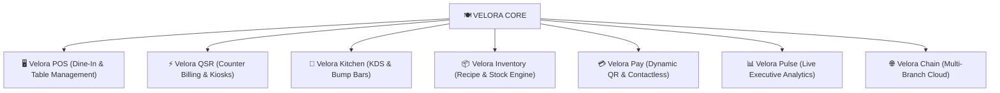

# 🍽️ Velora — Brand Identity, Name Selection & Architectural Roadmap

---

## 📌 Executive Summary

**Velora** (/vəˈlɔː.rə/) is an enterprise-grade food-service ecosystem engineered for specialty cafes, fine-dining restaurants, quick-service eateries (QSR), and modern hospitality operations.

This document records the foundational brand strategy, phonetic profile, etymological roots, visual guidelines, product architecture, and official raster graphic asset catalog for the **Velora** platform suite.

---

## 📖 1. What is Velora?

### 1.1 Phonetics & Pronunciation

| Attribute | Specification | Notes |
| :--- | :--- | :--- |
| **Written Form** | **Velora** | Roman script, title case |
| **IPA Transcription** | `/vəˈlɔː.rə/` or `/vɛˈlɔː.rə/` | Standard International Phonetic Alphabet |
| **Syllable Breakdown** | **Ve · Lo · Ra** | 3 melodic, fluid syllables |
| **Phonetic Pronunciation**| **"Veh - LOR - ah"** | `Ve` as in *velocity/velvet*, `Lor` as in *allure/aurora*, `Ah` open elegant vowel |

---

### 1.2 Etymology & Brand Essence

The name **Velora** synthesizes classical elegance with high-speed modern hospitality engineering:

```
      VELOCITY (Speed & Flow)              ALLURE / AURORA (Beauty & Warmth)
   [Frictionless QSR Efficiency]      +      [Elevated Dining Ambiance]
               \                                   /
                \                                 /
                 =================================
                          VELORA
                "Where Culinary Craft Meets
                 Effortless Digital Elegance"
```

1. **Velocity & Flow (*Vel-*)**:
   - Represents rapid table-turnover, 3-tap counter checkout, instantaneous kitchen routing, and zero cloud latency.
2. **Allure & Prestige (*-Lora*)**:
   - Evokes golden light (*aurora*), warmth, and the sensory refinement of artisanal cafes and luxury bistros.
3. **Simplicity & Global Recognition**:
   - Short, memorable, and globally recognized without language barriers.

---

## 🎯 2. Why the Name "Velora" Was Selected

1. **Modern, Minimalist & Timeless**:
   - Eliminates complex or localized jargon in favor of an upscale, international hospitality brand identity.
2. **No Clutter / Pure Brand Mark**:
   - Clean, standalone wordmark without forced taglines, allowing the brand to scale from boutique coffee bars to multinational franchises.
3. **Harmonious Geometric Visual Anchor**:
   - The initial **"V"** forms the iconic geometric monogram seamlessly holding a clean culinary fork.
4. **Effortless Multi-Theme Legibility**:
   - High-contrast visual balance in both dark mode (satin champagne gold on obsidian charcoal) and light mode (rich charcoal and warm gold on crisp white/cream).

---

## 🎨 3. Visual Identity & Color Palette

Velora moves away from heavy 3D bevels to an **elegant, minimalist, modern 2D flat-luxury aesthetic**:

```
+---------------------------------------------------------------------------------+
|  CHAMPAGNE GOLD      OBSIDIAN CHARCOAL       WARM IVORY        SLATE ACCENT     |
|     #D4AF37               #1E232A              #FAF8F5           #2C3440        |
|  (Craft & Brass)      (Primary Base)        (Clean Light)     (Bevel Depth)     |
+---------------------------------------------------------------------------------+
```

- **Satin Champagne Gold (`#D4AF37` / `#E5C27C`)**:
  - Highlights culinary warmth, premium cutlery, and refined dining service.
- **Obsidian Charcoal (`#1E232A`)**:
  - Deep matte tone for the left arm of the 'V' and primary light-mode typography.
- **Warm Ivory / Cream (`#FAF8F5`)**:
  - Pristine light-mode background ensuring comfortable, glare-free reading on POS touchscreens and guest digital bills.

---

## 🔤 4. Typography & Brand Standards

| Application | Primary Typeface | Characteristics |
| :--- | :--- | :--- |
| **Brand Wordmark** | **Montserrat Bold / ExtraBold** (Geometric Sans) | Clean, architectural, modern cafe aesthetic with generous tracking (`0.24em`). Solid champagne gold in dark mode, deep obsidian charcoal in light mode. |
| **Brand Glyph** | **Geometric 'V' Fork Monogram** | Asymmetrical dual-diagonal: Left arm in matte charcoal (`#1E232A`), right arm extending cleanly into a 3-tine culinary fork in champagne gold (`#D4AF37`). Pure and uncluttered (no spoon, no silver elements). |
| **Tagline Rule** | **Strictly No Tagline** | Wordmark stands cleanly as pure `VELORA`. Subtext such as `POS - KOS - QSR` or `Cafe & Restaurant` is completely omitted. |

---

## 🏛️ 5. Product Architecture & Ecosystem



---

## 📂 6. Official Raster Graphic Asset Catalog

All vector SVGs and previous assets have been deleted. The official brand suite consists of **high-resolution transparent Raster PNGs** located in [`frontend/public/`](file:///c:/Learning/projects/vidhara-qsr/frontend/public/):

| # | Asset Type | File Name | Mode | Dimensions | Best Use Case |
| :- | :--- | :--- | :--- | :--- | :--- |
| **1** | **Master Horizontal Logo** | [`velora-logo-dark.png`](file:///c:/Learning/projects/vidhara-qsr/frontend/public/velora-logo-dark.png) | 🌙 Dark | `1080 × 360 px` | Dark navbars, dark POS headers, storefront signboards |
| **2** | **Master Horizontal Logo** | [`velora-logo-light.png`](file:///c:/Learning/projects/vidhara-qsr/frontend/public/velora-logo-light.png) | ☀️ Light | `1080 × 360 px` | White/cream invoices, bills, guest receipts, menus |
| **3** | **Standalone Wordmark** | [`velora-wordmark-dark.png`](file:///c:/Learning/projects/vidhara-qsr/frontend/public/velora-wordmark-dark.png) | 🌙 Dark | `750 × 240 px` | Clean minimal header, ambient glowing text |
| **4** | **Standalone Wordmark** | [`velora-wordmark-light.png`](file:///c:/Learning/projects/vidhara-qsr/frontend/public/velora-wordmark-light.png) | ☀️ Light | `750 × 240 px` | Print receipts, crisp light storefront glass |
| **5** | **App Icon & Symbol** | [`velora-icon-dark.png`](file:///c:/Learning/projects/vidhara-qsr/frontend/public/velora-icon-dark.png) | 🌙 Dark | `460 × 660 px` | Mobile app shortcut, social avatar, stamps |
| **6** | **App Icon & Symbol** | [`velora-icon-light.png`](file:///c:/Learning/projects/vidhara-qsr/frontend/public/velora-icon-light.png) | ☀️ Light | `460 × 660 px` | Light app interfaces, watermark stamp |
| **7** | **Square 1:1 App Canvas** | [`velora-icon-square.png`](file:///c:/Learning/projects/vidhara-qsr/frontend/public/velora-icon-square.png) | Universal | `1024 × 1024 px` | App Store submissions, PWA manifest |
| **8** | **Circular Restaurant Medallion** | [`velora-emblem-dark.png`](file:///c:/Learning/projects/vidhara-qsr/frontend/public/velora-emblem-dark.png) | 🌙 Dark | `960 × 960 px` | Beverage coasters, uniform embroidery, seals |
| **9** | **Circular Restaurant Medallion** | [`velora-emblem-light.png`](file:///c:/Learning/projects/vidhara-qsr/frontend/public/velora-emblem-light.png) | ☀️ Light | `960 × 960 px` | Coasters on light surfaces, stamps on napkins |
| **10**| **Browser Favicon** | [`favicon.png`](file:///c:/Learning/projects/vidhara-qsr/frontend/public/favicon.png) | Universal | `64 × 64 px` | Browser tab icon |

---

### 🖥️ Interactive Showcase

Open [`frontend/public/logo-showcase.html`](file:///c:/Learning/projects/vidhara-qsr/frontend/public/logo-showcase.html) in your browser to inspect all raster assets, toggle between Dark and Light mode, and download any asset with one click.

---

*Document Author: Velora Brand Engineering & Design System*  
*Last Updated: 2026-09-04*
