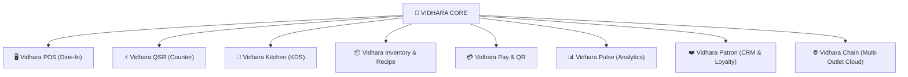

# 🌿 Vidhara — Brand Identity, Name Selection & Architectural Roadmap

---

## 📌 Executive Summary

**Vidhara** (/vɪˈdʱaː.raː/) is an enterprise-grade food-service ecosystem engineered for fast-casual cafes, quick-service restaurants (QSR), fine-dining establishments, and modern cloud kitchens.

This document records the foundational brand strategy, phonetic profile, etymological roots, product architecture, and iconographic guidelines for all present and future modules in the Vidhara platform suite.

---

## 📖 1. What is Vidhara?

### 1.1 Phonetics & Pronunciation

| Attribute | Specification | Notes |
| :--- | :--- | :--- |
| **Written Form** | **Vidhara** | Roman script, title case |
| **Devanagari** | **विधा़रा** / **विधारा** | Cultural and vernacular resonance |
| **IPA Transcription** | `/vɪˈdʱaː.raː/` | Standard International Phonetic Alphabet |
| **Syllable Breakdown** | **Vi · Dha · Ra** | 3 clean, rhythmic syllables |
| **Phonetic Pronunciation**| **"Vi - DHA - rah"** | `Vi` as in *vision*, `Dha` with gentle aspiration as in *Dharma*, `Ra` with an open melodic vowel |

---

### 1.2 Etymology & Semantic Roots

The name **Vidhara** is a thoughtful, evocative portmanteau born from two profound cultural and culinary pillars:

```
    VIDHARBHA (विदर्भ)                    DHARA (धारा / धरा)
 [Heartland, Spice & Soul]       +     [Eternal Flow, Abundance & Earth]
             \                                 /
              \                               /
               ===============================
                      VIDHARA (विधारा)
              "The Continuous Flow of Flavor,
               Warm Hospitality & Innovation"
```

1. **Vidharbha (विदर्भ)**:
   - The historic heartland of central India, celebrated for its fertile black cotton soil (*Regur*), sun-drenched orange groves, and world-famous **Saoji** spice culinary heritage.
   - Represents bold flavors, authentic hospitality, uncompromised taste, and cultural warmth.

2. **Dhara (धारा — The Stream / Flow)**:
   - In Sanskrit and Hindi, **धारा (Dhaaraa)** symbolizes an *unceasing stream, a continuous cascade, or a rhythmic flow*.
   - In food service, this evokes the hypnotic pouring of hot coffee and tea, the continuous flow of orders from POS to kitchen, and frictionless guest dining experiences.

3. **Dhara (धरा — The Earth)**:
   - In classical Sanskrit, **धरा (Dharaa)** translates to *the Mother Earth, the nurturer and provider of all grains, spices, and nourishment*.
   - Grounds the brand in fresh, authentic, farm-to-table culinary purity.

---

## 🎯 2. Why the Name "Vidhara" Was Selected

Selecting the name **Vidhara** was driven by six strategic brand criteria:

### 1. Cultural Authenticity Meets Modern Minimalism
Many restaurant software brand names sound sterile, clinical, or like generic SaaS tools (e.g., *PosCloud*, *QuickDine*). **Vidhara** has soul, musicality, and deep cultural authenticity while remaining sleek, modern, and memorable on an international scale.

### 2. High Phonetic Fluidity & Global Ease of Pronunciation
With its alternating consonant-vowel cadence (`V-I-D-H-A-R-A`), the name rolls smoothly off the tongue across languages, making it effortless for cashiers, waitstaff, restaurateurs, and diners alike.

### 3. Visual & Geometric Symmetry (The 'V' Anchor)
The initial letter **"V"** provides a natural geometric anchor for culinary branding:
- Can be shaped as an elegant convergence of a **Fork** and a **Spoon**.
- Symbolizes **Victory**, **Velocity** (speed for QSR), and **Value**.

### 4. Semantic Versatility Across Hospitality Verticals
Whether applied to an artisanal single-origin cafe, a bustling highway QSR, a rooftop microbrewery, or a multi-unit cloud kitchen franchise, **Vidhara** sounds premium, grounded, and dignified.

### 5. Unified Technology & Operational Flow
Because *Dhara* translates to *stream*, the name mirrors the operational engine of the system: seamless data streaming between table ordering, counter billing, real-time inventory deduction, and kitchen display ticket routing.

---

## 🎨 3. Brand Color Palette & Symbolic Meaning

The palette directly honors both **Vidharbha's spice terroir** and the warm, welcoming ambiance of **contemporary specialty cafes**:

```
+--------------------------------------------------------------------------------+
|  VIDHARBHA GOLD    SAOJI AMBER     CULINARY CRIMSON   ROASTED ESPRESSO   OBSIDIAN  |
|     #F59E0B          #EA580C           #E11D48            #2D1A15        #0D0604   |
|   (Hospitality)     (Energy)        (Appetite)          (Cafe Base)     (Luxury)   |
+--------------------------------------------------------------------------------+
```

- **Vidharbha Gold (`#F59E0B` ➔ `#FEF08A`)**:
  - Symbolizes turmeric root, morning sunshine, warm lighting fixtures, brass dinnerware, and generous hospitality.
- **Saoji Amber (`#EA580C`) & Crimson (`#E11D48`)**:
  - Symbolizes culinary passion, roasted spices, appetizing sauces, wood-fired hearths, and dining excitement.
- **Roasted Espresso Brown (`#2D1A15`)**:
  - Grounded in artisanal cafe culture, roasted Arabica beans, dark mahogany countertops, and cozy dining spaces.
- **Obsidian Charcoal (`#0D0604`)**:
  - High-contrast slate and cast iron, creating an ultra-modern luxury aesthetic.

---

## 🏛️ 4. Product Ecosystem & Future Module Architecture

The Vidhara platform is engineered as an interconnected suite of modular services. Each module serves a specialized role while communicating over an event-driven core.



---

### Module Breakdown

#### 1. Vidhara POS (Dine-In Management)
- **Role**: High-performance Point of Sale for full-service dining, bistros, and restro-bars.
- **Core Capabilities**: Multi-floor visual table maps, guest seat assignment, split bills, multi-steward KOT printing, and table status lifecycle (`Available` ➔ `Seated` ➔ `Order Placed` ➔ `Bill Printed` ➔ `Settled`).

#### 2. Vidhara QSR (Quick Service & Fast Casual)
- **Role**: Ultra-fast terminal optimized for speed of service, high footfall, and takeaway queues.
- **Core Capabilities**: 3-tap rapid order checkout, order token queueing, customer-facing display (CFD), takeaway/drive-thru flow, and combo modifier engineering.

#### 3. Vidhara Kitchen (Kitchen Display System — KDS)
- **Role**: Digital station routing replacing paper tickets in high-heat commercial kitchens.
- **Core Capabilities**: Ticket age alerts (Green ➔ Amber ➔ Red), item-level bump bar support, multi-station routing (Grill, Fryer, Beverage, Dessert), and prep time analytics.

#### 4. Vidhara Inventory & Recipe Engine
- **Role**: Precise cost of goods sold (COGS) tracking and recipe-linked automated deduction.
- **Core Capabilities**: Atomic ingredient deduction per dish ordered, raw material waste tracking, minimum safety thresholds, purchase order (PO) workflows, and batch expiry control.

#### 5. Vidhara Pay & QR
- **Role**: Frictionless digital payments and at-table self-ordering.
- **Core Capabilities**: Dynamic table-top UPI QR codes, instant payment webhook reconciliation, digital bill SMS/WhatsApp delivery, and tip splitting.

#### 6. Vidhara Pulse (Executive Analytics & Intelligence)
- **Role**: Executive command center for business owners and general managers.
- **Core Capabilities**: Real-time sales telemetry, hourly peak heatmaps, menu engineering matrix (Stars, Cash Cows, Puzzles, Dogs), staff performance metrics, and inventory leakage alerts.

#### 7. Vidhara Patron (CRM, Loyalty & Guest Experience)
- **Role**: Personalized guest relationship building.
- **Core Capabilities**: Visit history tracking, favorite dish preferences, automated birthday/anniversary rewards, custom cashback wallets, and post-dining review loops.

#### 8. Vidhara Chain (Multi-Outlet Enterprise & Franchise Cloud)
- **Role**: Centralized command for multi-branch brands and franchise networks.
- **Core Capabilities**: Global menu and price master sync, central commissary kitchen distribution, cross-outlet sales auditing, and role-based regional access controls.

---

## 🎨 5. Future Icon Creation Guidelines for Modules

To maintain total visual unity across apps, browser tabs, native desktop wrappers, and mobile handhelds, every Vidhara module must follow these strict iconographic principles.

### 5.1 Universal Icon Blueprint

```
+-------------------------------------------------------------+
|                     [ 512 x 512 CANVAS ]                     |
|                                                             |
|   1. Background: Squircle (Corner Radius: 108px)            |
|      - Fill: Radial gradient (#2D1A15 to #0D0604)           |
|      - Border: 2px solid Vidharbha Gold (#F59E0B) @ 30%     |
|                                                             |
|   2. Dhara Concentric Ring: Outer circle @ 25% opacity      |
|                                                             |
|   3. Central Module Glyph: Sculpted vector mark             |
|      - Gradient fill using the official brand ramp          |
|      - Subtle ambient drop shadow (#000000 @ 40%)           |
|                                                             |
|   4. Converging 'Dhara' Node: Micro spice star or droplet   |
+-------------------------------------------------------------+
```

---

### 5.2 Specific Module Icon Concepts & Specifications

| Module Name | Icon Concept | Visual Elements | Color Accent |
| :--- | :--- | :--- | :--- |
| **Vidhara Master (Brand)** | **Fork & Spoon 'V' Monogram** | Interlocking fork (left) & spoon (right) forming 'V', rising aroma spice star | `Vidharbha Gold` & `Saoji Crimson` |
| **Vidhara POS** | **Table & Cashflow Register** | Sleek modern POS terminal screen with an embossed dining plate and currency tick | `Gold` + `Warm Amber` |
| **Vidhara QSR** | **Velocity Lightning Fork** | Stylized coffee cup / burger flanked by high-speed dual chevrons symbolizing rapid checkout | `Vibrant Orange` (`#EA580C`) |
| **Vidhara Kitchen** | **Flame Toque & Digital Pan** | Chef’s hat silhouette merging with a live sizzling skillet and digital signal waves | `Saoji Crimson` (`#E11D48`) |
| **Vidhara Inventory** | **Ingredient Sack & Measuring Stream** | Modern storage crate/sack with a downward measuring stream (*Dhara*) of spices/grains | `Turmeric Gold` (`#FBBF24`) |
| **Vidhara Pulse** | **Rising Culinary Flame Bar Chart** | Ascending analytics bar chart whose highest bar erupts into an illuminated spice star | `Emerald & Gold` |
| **Vidhara Pay** | **Contactless Dining Wave** | Golden credit card / dining coin emitting dual contactless waves shaped like liquid droplets | `Cyan-Gold Radiant` |
| **Vidhara Patron** | **Heart-Formed Teacup / Plate** | Porcelain saucer where the rising latte steam forms a delicate heart monogram | `Rose-Gold Crimson` |
| **Vidhara Chain** | **Network of Dining Domes** | Interconnected constellation of three silver cloches / restaurant domes linked by fiber lines | `Champagne Platinum` |

---

## 🔤 6. Typography & Brand Styling Standards

| Application | Primary Typeface | Characteristics |
| :--- | :--- | :--- |
| **Brand Wordmark** | **Montserrat Bold / ExtraBold** (Geometric Sans) | Clean, architectural, modern cafe aesthetic with generous tracking (`0.24em`). Warm metallic gold in dark mode and rich charcoal in light mode. |
| **Brand Mark / Glyph** | **Geometric 'V' Fork Monogram** | Minimalist dual-diagonal: Left arm in deep matte charcoal (`#1E232A`), right arm extending directly into a clean 3-tine culinary fork in warm golden ochre (`#C59B4E`). No spoon, no silver elements. |
| **Tagline Status** | **No Tagline** | Wordmark stands cleanly as pure `VIDHARA`. All subtext (`POS - KOS - QSR` and `Cafe & Restaurant`) has been removed. |

---

## 📂 7. Official Brand Asset Catalog

All vector SVGs and previous iterations have been removed in favor of high-resolution **Transparent Raster PNG** artwork inside [`frontend/public/`](file:///c:/Learning/projects/vidhara-qsr/frontend/public/):

### 1. Master Horizontal Brandmark (Symbol + VIDHARA)
- **Dark Mode Transparent PNG**: [`vidhara-logo-dark.png`](file:///c:/Learning/projects/vidhara-qsr/frontend/public/vidhara-logo-dark.png) *(Charcoal & Gold Symbol with Golden VIDHARA)*
- **Light Mode Transparent PNG**: [`vidhara-logo-light.png`](file:///c:/Learning/projects/vidhara-qsr/frontend/public/vidhara-logo-light.png) *(High-contrast with clean depth)*

### 2. Standalone Wordmark (Only "VIDHARA")
- **Dark Mode Wordmark (Metallic Gold)**: [`vidhara-wordmark-dark.png`](file:///c:/Learning/projects/vidhara-qsr/frontend/public/vidhara-wordmark-dark.png)
- **Light Mode Wordmark (Deep Charcoal)**: [`vidhara-wordmark-light.png`](file:///c:/Learning/projects/vidhara-qsr/frontend/public/vidhara-wordmark-light.png)

### 3. App Icon & Culinary Symbol (Geometric 'V' Fork Only — NO SPOON)
- **Dark Mode Symbol**: [`vidhara-icon-dark.png`](file:///c:/Learning/projects/vidhara-qsr/frontend/public/vidhara-icon-dark.png)
- **Light Mode Symbol**: [`vidhara-icon-light.png`](file:///c:/Learning/projects/vidhara-qsr/frontend/public/vidhara-icon-light.png)

### 4. Square 1:1 App Icon Canvas & Favicon
- **Square 1024x1024 Canvas**: [`vidhara-icon-square.png`](file:///c:/Learning/projects/vidhara-qsr/frontend/public/vidhara-icon-square.png) *(Transparent)*
- **Browser Favicon (64x64)**: [`favicon.png`](file:///c:/Learning/projects/vidhara-qsr/frontend/public/favicon.png)

### 5. Circular Restaurant Medallion (Fork inside — NO SPOON)
- **Dark Mode Medallion**: [`vidhara-emblem-dark.png`](file:///c:/Learning/projects/vidhara-qsr/frontend/public/vidhara-emblem-dark.png) *(Brushed Gold rim, Charcoal disc, central 'V' Fork, arched VIDHARA)*
- **Light Mode Medallion**: [`vidhara-emblem-light.png`](file:///c:/Learning/projects/vidhara-qsr/frontend/public/vidhara-emblem-light.png)

---

### 🖥️ Interactive Showcase
Open [`frontend/public/logo-showcase.html`](file:///c:/Learning/projects/vidhara-qsr/frontend/public/logo-showcase.html) in your browser to inspect all raster assets, toggle between Dark and Light mode, and download any asset with one click.

---

*Document Author: Vidhara Brand Engineering & Design System*  
*Last Updated: 2026-09-03*
