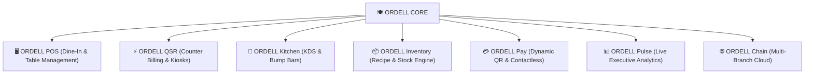

# 🍽️ ORDELL — Brand Identity, Name Selection & Architectural Roadmap

---

## 📌 Executive Summary

**ORDELL** (/ɔːrˈdɛl/) is an enterprise-grade food-service ecosystem engineered for specialty cafes, fine-dining restaurants, quick-service eateries (QSR), cloud kitchens, and modern hospitality operations.

This document records the foundational brand strategy, phonetic profile, etymological roots, visual guidelines, product architecture, and official graphic asset catalog for the **ORDELL** platform suite.

---

## 📖 1. What is ORDELL?

### 1.1 Phonetics & Pronunciation

| Attribute | Specification | Notes |
| :--- | :--- | :--- |
| **Written Form** | **ORDELL** | Roman script, all caps / title case |
| **IPA Transcription** | `/ɔːrˈdɛl/` | Standard International Phonetic Alphabet |
| **Syllable Breakdown** | **Or · Dell** | 2 punchy, memorable syllables |
| **Phonetic Pronunciation**| **"Or - DELL"** | `Or` as in *Order/Origin*, `Dell` as in *Deliver/Excel* |

---

### 1.2 Etymology & Brand Essence

The name **ORDELL** directly conveys mastery over hospitality throughput:

```
       ORDER (Flow & Precision)             EXCELLENCE & OPERATIONS (Execution)
    [Frictionless POS Checkout]       +      [Recipe Inventory & High Throughput]
                \                                   /
                 \                                 /
                  =================================
                               ORDELL
                  "Order, Operations and Billing"
```

1. **Order & Flow (*Ord-*)**:
   - Rapid order creation, instant 0ms offline dispatch, split settlements, and kitchen order routing.
2. **Operations & Billing (*-Dell*)**:
   - Robust restaurant management, inventory deduction, ledger analytics, and fiscal compliance.
3. **The Signature Accent**:
   - The letter **"R"** features a vibrant solar orange diagonal kick, serving as the visual anchor of momentum and energetic hospitality service.

---

## 🎯 2. Why the Name "ORDELL" Was Selected

1. **Modern, Authoritative & Memorable**:
   - Direct, crisp, two-syllable name that commands trust and clarity at the billing counter.
2. **Seamless Subtitle Hierarchy**:
   - Accompanied by the clean descriptive subtitle: **"Order, Operations and Billing"**.
3. **Dynamic 3D Ribbon 'O' Visual Anchor**:
   - The initial **"O"** is styled as an isometric, continuous dimensional ribbon loop transitioning from solar orange to electric royal blue.
4. **Effortless Multi-Theme Legibility**:
   - High-contrast visual balance in both dark mode (crisp off-white typography with solar orange 'R' kick on obsidian navy) and light mode (midnight navy typography with solar orange 'R' kick on clean cream).

---

## 🎨 3. Visual Identity & Color Palette

ORDELL features a vibrant, modern dimensional aesthetic:

```
+---------------------------------------------------------------------------------+
|  SOLAR ORANGE         ELECTRIC BLUE         MIDNIGHT NAVY       CLEAN SLATE     |
|     #FF6D00              #0070F3               #0B1528            #F8FAFC       |
|  (Energy & Kick)     (Speed & Logic)       (Dark Base Text)    (Light Base Text)|
+---------------------------------------------------------------------------------+
```

- **Solar Orange (`#FF6D00` / `#FFA000`)**:
   - Highlights order velocity, warmth, appetite appeal, and the iconic signature diagonal leg of the 'R'.
- **Electric Royal Blue (`#0070F3` / `#00B0FF`)**:
   - Represents cloudless local speed, database integrity, and modern engineering.
- **Midnight Navy (`#0B1528` / `#0F172A`)**:
   - Deep structural foundation for typography in light mode and container frames.
- **Crisp Off-White (`#F8FAFC`)**:
   - High-contrast typography on dark mode dashboards and POS terminals.

---

## 🔤 4. Typography & Brand Standards

| Application | Primary Typeface | Characteristics |
| :--- | :--- | :--- |
| **Brand Wordmark** | **Geometric Rounded Sans (All Caps)** | Bold, rounded geometry. Midnight navy in light mode, crisp white in dark mode. The 'R' lower-right leg is an isolated vibrant solar orange slash. |
| **Brand Glyph** | **3D Ribbon 'O' Loop** | Continuous fluid ribbon ring transitioning from golden-orange on the outer curve to electric royal blue on the inner loop with negative space separation. |
| **Official Subtitle**| **"Order, Operations and Billing"** | Balanced, medium tracking beneath the ORDELL wordmark. |

---

## 🏛️ 5. Product Architecture & Ecosystem


```mermaid
graph TD
    O_CORE["🍽️ ORDELL CORE"] --> O_POS["🖥️ ORDELL POS (Dine-In & Table Management)"]
    O_CORE --> O_QSR["⚡ ORDELL QSR (Counter Billing & Kiosks)"]
    O_CORE --> O_KDS["🍳 ORDELL Kitchen (KDS & Bump Bars)"]
    O_CORE --> O_INV["📦 ORDELL Inventory (Recipe & Stock Engine)"]
    O_CORE --> O_PAY["💳 ORDELL Pay (Dynamic QR & Contactless)"]
    O_CORE --> O_PULSE["📊 ORDELL Pulse (Live Executive Analytics)"]
    O_CORE --> O_CHAIN["🌐 ORDELL Chain (Multi-Branch Cloud)"]
```

---

## 📂 6. Official Graphic Asset Catalog

The official brand suite consists of **high-resolution transparent Raster PNGs & SVGs** located in [`frontend/public/`](file:///c:/Learning/projects/qsrsystem/frontend/public/):

| # | Asset Type | File Name | Mode | Dimensions | Best Use Case |
| :- | :--- | :--- | :--- | :--- | :--- |
| **1** | **Master Horizontal Logo** | [`ordell-logo-dark.png`](file:///c:/Learning/projects/qsrsystem/frontend/public/ordell-logo-dark.png) | 🌙 Dark | `1200 × 360 px` | Dark navbars, dark POS headers, storefront signboards |
| **2** | **Master Horizontal Logo** | [`ordell-logo-light.png`](file:///c:/Learning/projects/qsrsystem/frontend/public/ordell-logo-light.png) | ☀️ Light | `1200 × 360 px` | White/cream invoices, bills, guest receipts, menus |
| **3** | **Standalone Wordmark** | [`ordell-wordmark-dark.png`](file:///c:/Learning/projects/qsrsystem/frontend/public/ordell-wordmark-dark.png) | 🌙 Dark | `850 × 400 px` | Clean minimal header, ambient glowing text |
| **4** | **Standalone Wordmark** | [`ordell-wordmark-light.png`](file:///c:/Learning/projects/qsrsystem/frontend/public/ordell-wordmark-light.png) | ☀️ Light | `850 × 400 px` | Print receipts, crisp light storefront glass |
| **5** | **App Icon & Symbol** | [`ordell-icon-dark.png`](file:///c:/Learning/projects/qsrsystem/frontend/public/ordell-icon-dark.png) | 🌙 Dark | `512 × 512 px` | Mobile app shortcut, social avatar, stamps |
| **6** | **App Icon & Symbol** | [`ordell-icon-light.png`](file:///c:/Learning/projects/qsrsystem/frontend/public/ordell-icon-light.png) | ☀️ Light | `512 × 512 px` | Light app interfaces, watermark stamp |
| **7** | **Square 1:1 App Canvas** | [`ordell-icon-square.png`](file:///c:/Learning/projects/qsrsystem/frontend/public/ordell-icon-square.png) | Universal | `1024 × 1024 px` | App Store submissions, PWA manifest |
| **8** | **Circular Restaurant Medallion** | [`ordell-emblem-dark.png`](file:///c:/Learning/projects/qsrsystem/frontend/public/ordell-emblem-dark.png) | 🌙 Dark | `648 × 648 px` | Beverage coasters, uniform embroidery, seals |
| **9** | **Circular Restaurant Medallion** | [`ordell-emblem-light.png`](file:///c:/Learning/projects/qsrsystem/frontend/public/ordell-emblem-light.png) | ☀️ Light | `648 × 648 px` | Coasters on light surfaces, stamps on napkins |
| **10**| **Browser Favicon (PNG)** | [`favicon.png`](file:///c:/Learning/projects/qsrsystem/frontend/public/favicon.png) | Universal | `64 × 64 px` | Browser tab icon |
| **11**| **Browser Favicon (SVG)** | [`favicon.svg`](file:///c:/Learning/projects/qsrsystem/frontend/public/favicon.svg) | Universal | Vector | Scalable browser favicon |
| **12**| **POS Favicon (SVG)** | [`favicon-pos.svg`](file:///c:/Learning/projects/qsrsystem/frontend/public/favicon-pos.svg) | Universal | Vector | POS terminal favicon |

---

### 🖥️ Interactive Showcase

Open [`frontend/public/logo-showcase.html`](file:///c:/Learning/projects/qsrsystem/frontend/public/logo-showcase.html) in your browser to inspect all raster assets, toggle between Dark and Light mode, and download any asset with one click.

---

*Document Author: ORDELL Brand Engineering & Design System*  
*Last Updated: September 2026*
