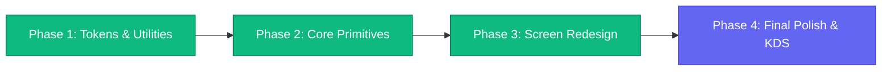

# 🎨 Frontend Architecture & Multi-Device Design System

Comprehensive architectural guide and styling specification for the **Vidhara QSR POS & Restaurant Management Frontend**. This document outlines the modern design system built on **React 19**, **Vite**, **Tailwind CSS v4**, and **Shadcn UI design patterns**, specifically engineered for pixel-perfect responsiveness across all restaurant hardware devices.

---

## 📌 Table of Contents
1. [Executive Summary & Tech Stack](#1-executive-summary--tech-stack)
2. [Multi-Device Hardware Breakpoints](#2-multi-device-hardware-breakpoints)
3. [Modern Cafe & Restaurant Theme Palette](#3-modern-cafe--restaurant-theme-palette)
4. [Touch-Screen Ergonomics & Hardware Optimizations](#4-touch-screen-ergonomics--hardware-optimizations)
5. [Utility Architecture (`cn()` Helper)](#5-utility-architecture-cn-helper)
6. [Core Reusable Touch Primitives](#6-core-reusable-touch-primitives-srccomponentsui)
7. [Component Migration & Implementation Roadmap](#7-component-migration--implementation-roadmap)

---

## 1. Executive Summary & Tech Stack

| Layer | Technology | Purpose |
| :--- | :--- | :--- |
| **Framework** | **React 19 (`^19.2.8`)** | Zero runtime overhead, Concurrent Mode, clean modern hooks. |
| **Bundler** | **Vite 8 (`^8.2.0`)** | Instant Hot Module Replacement (HMR) and optimized static asset chunking. |
| **Styling Engine** | **Tailwind CSS v4 (`^4.3.3`)** | Zero runtime CSS-in-JS, pure compile-time utility optimization via `@tailwindcss/vite`. |
| **Class Merging** | **`clsx` + `tailwind-merge`** | Conflict-free conditional styling utility (`cn()`). |
| **Iconography** | **Lucide React (`^1.39.0`)** | High-performance, lightweight SVG icon suite. |
| **Architecture** | **Shadcn UI Principles** | Headless accessible primitives owned directly in the project codebase. |

---

## 2. Multi-Device Hardware Breakpoints

Commercial restaurant environments operate on widely differing physical form factors. The system configures dedicated hardware breakpoints (`src/index.css`):

```css
@theme {
  --breakpoint-xs: 360px;       /* 📱 Waiter Mobile: iPhone SE, Galaxy A (Captain App) */
  --breakpoint-sm: 640px;       /* 📱 Phablet / Large Handheld POS Terminal */
  --breakpoint-md: 768px;       /* 📟 Tablet: iPad / Android Tablets (Table & Floor POS) */
  --breakpoint-touch: 1024px;   /* 🖥️ 4:3 Commercial Touch POS Screens (1024x768 billing terminals) */
  --breakpoint-lg: 1024px;      /* 💻 Standard POS Display / Landscape Tablet */
  --breakpoint-xl: 1280px;      /* 🖥️ 16:9 Desktop Billing PCs / Manager Workstations */
  --breakpoint-2xl: 1536px;     /* 📺 Large Kitchen Display System (KDS) & Wall Monitors */
}
```

### Layout Mapping by Device:
- **Mobile Waiters (`< 768px`)**: Single-column vertical layout, sticky top category pills, bottom floating order summary bar, and slide-up cart drawer.
- **Tablets (`768px – 1023px`)**: Split 2-pane view with collapsible table/floor sidebar and touch-friendly product tiles.
- **Counter Touch POS (`1024px – 1280px`)**: High-density 3-pane view: Table/Area selector on left, Category tabs & item grid in center, and sticky live cart + numpad on right.
- **Kitchen Displays (`>= 1280px`)**: Full-screen grid of dynamic ticket cards with status timers and 1-tap fulfillment toggles.

---

## 3. Modern Cafe & Restaurant Theme Palette

Crafted for artisan cafes, bistros, bakeries, and quick-service food chains:

### ☕ Artisan Brand Palette (Warm Honey Amber & Espresso)
- `brand-50` (`#fffbeb`) to `brand-900` (`#78350f`)
- **Primary Accent**: `--color-brand-500` (`#f59e0b` / Warm Honey Amber)
- **Active / Press**: `--color-brand-600` (`#d97706` / Golden Caramel)
- **Dark Roast Surfaces**: `--color-brand-900` (`#78350f` / Deep Espresso)

### 🥗 FSSAI Dietary Status Indicators
- **Pure Veg**: `--color-food-veg` (`#16a34a` / Fresh Basil Green) + badge dot
- **Non-Veg**: `--color-food-nonveg` (`#dc2626` / Crimson Red) + badge triangle
- **Contains Egg**: `--color-food-egg` (`#ca8a04` / Egg Yolk Ochre)
- **Beverages & Cold Brews**: `--color-food-drink` (`#0284c7` / Deep Sky)

### 🌗 Theme Surfaces
- **Light Theme**: Warm bakery linen (`#faf8f5`) with crisp white card surfaces (`#ffffff`) and soft stone borders (`#e7e5e4`).
- **Dark Theme**: Midnight obsidian (`#0c0f17`) with rich slate cards (`#121722`) and refined borders (`#1e293b`).

---

## 4. Touch-Screen Ergonomics & Hardware Optimizations

1. **300ms Click Delay Elimination**:
   `touch-action: manipulation;` applied globally to all buttons, links, and clickable surfaces to guarantee instant response time during high-speed billing rush hours.
2. **Accidental Selection Prevention**:
   `-webkit-user-select: none; user-select: none;` applied to POS keys, numpads, and food item cards so rapid multi-touch taps never trigger blue text highlights or context menus.
3. **Tactile Touch Feedback**:
   `.pos-keypad-btn` and touch targets include micro-spring transitions (`transform: scale(0.95)`) on `:active` touch for reassuring physical feedback.
4. **Custom Low-Friction Scrollbars**:
   Thin rounded 6px scrollbars that blend smoothly into touch surfaces without obstructing bill items or order lists.

---

## 5. Utility Architecture (`cn()` Helper)

Located at [`frontend/src/lib/utils.ts`](file:///c:/Learning/projects/vidhara-qsr/frontend/src/lib/utils.ts):

```typescript
import { clsx, type ClassValue } from 'clsx';
import { twMerge } from 'tailwind-merge';

export function cn(...inputs: ClassValue[]): string {
  return twMerge(clsx(inputs));
}
```

### Usage Pattern:
```tsx
// Safely merges defaults with custom overrides and conditional states
<button
  className={cn(
    "px-4 py-2 rounded-xl font-semibold transition-all pos-keypad-btn",
    isActive ? "bg-amber-500 text-stone-900 shadow-md" : "bg-stone-100 text-stone-700",
    className
  )}
>
  {children}
</button>
```

---

## 6. Core Reusable Touch Primitives (`src/components/ui/`)

All primitives are headless-styled, accessible, fully responsive, and export cleanly from `src/components/ui`:

### 1. `Button` (`Button.tsx`)
- **Variants**: `primary` (Amber 500), `secondary` (Stone), `outline`, `ghost`, `danger` (Rose), `success` (Emerald), `amber` (Light amber tint).
- **Sizes**: `sm`, `md`, `lg`, `touch` (52px minimum touch target for rapid POS tapping), `icon`.
- **States**: Built-in `isLoading` spinner (`Loader2`), `leftIcon`, `rightIcon`, disabled, and active micro-scale press (`scale-[0.97]`).

### 2. `Input` (`Input.tsx`)
- **Features**: Accessible label, floating helper text, dynamic error message, `leftIcon` (e.g. search / phone), `rightIcon`, focus ring in amber/rose, and disabled states.

### 3. `Badge` (`Badge.tsx`)
- **Dietary Support**: Built-in FSSAI food tags:
  - `veg`: Fresh green border with green dot inside.
  - `nonveg`: Crimson red border with red triangle inside.
  - `egg`: Ochre yellow border.
  - `drink`: Sky blue badge for beverages/brews.
- **Operational Statuses**: `success`, `warning`, `danger`, `brand`, `outline`.

### 4. `Card` (`Card.tsx`)
- Compound component structure: `Card`, `CardHeader`, `CardTitle`, `CardDescription`, `CardContent`, `CardFooter`.
- Supports `hoverable` (elevation + border glow on touch/mouse) and `active` (persistent selection ring for tables or items).

### 5. `Modal` (`Modal.tsx`)
- **Adaptive Viewport**:
  - **Mobile (`< 640px`)**: Renders automatically as a modern rounded **bottom sheet** with drag pill indicator.
  - **Tablet & Desktop (`>= 640px`)**: Renders as an elegant centered dialog with backdrop blur.
- Keyboard navigation (Escape key to dismiss) and backdrop click dismissal.

### 6. `Drawer` (`Drawer.tsx`)
- Slide-over panel supporting `right`, `left`, and `bottom` directions.
- Essential for **Mobile Waiter Cart view** and slide-out floor/table selectors.

### 7. `Numpad` (`Numpad.tsx`)
- Commercial touch billing numpad:
  - Quick Indian cash addition row (`+₹100`, `+₹200`, `+₹500`, `+₹2000`).
  - Tactile 4x3 digit grid (1–9, 0, decimal / clear, backspace).
  - High-contrast action confirm bar (`onEnter`).

### 8. `Tooltip` (`Tooltip.tsx`)
- Universal hover & focus tooltip:
  - Custom positions: `top`, `bottom`, `left`, `right`.
  - Configurable delay, dark elevation styling, and pointer-events safe.

### 9. `Select` (`Select.tsx`)
- Eye-catching dropdown component:
  - Single-select and multi-select (with removable pill badges).
  - Built-in instant search filtering.
  - Keyboard accessible and animated transition.

### 10. `CafeBrandBadge` (`CafeBrandBadge.tsx`)
- Universal store identity badge across all headers, sidebars, and terminals:
  - Displays uploaded cafe logo from `storeProfile.logoUrl`.
  - Automatic stylish monogram fallback (e.g. "Mocha Bliss" -> `MB`, "The Urban Bistro" -> `UB`).
  - Operational status dot (`emerald` active indicator) and cafe code tag.

### 11. `StoreProfileModal` (`StoreProfileModal.tsx`)
- Comprehensive store identity & logo management:
  - Instant file upload (PNG, JPG, WebP, SVG) converted to data URI.
  - Business name, manager name, phone, address, GSTIN, and receipt footer message.
  - Coupled with backend endpoints: `GET /setting/profile` and `POST /setting/profile`.

---

## 7. Component Migration & Implementation Roadmap



- ✅ **Phase 1 (Completed)**: 
  - Installed `clsx` & `tailwind-merge`.
  - Configured `frontend/src/lib/utils.ts`.
  - Defined full responsive hardware breakpoints (`xs`, `sm`, `md`, `touch`, `lg`, `xl`, `2xl`) and cafe color tokens in `frontend/src/index.css`.
  - Verified compilation (`vite build` purged CSS down to 11KB).
- ✅ **Phase 2 (Completed)**:
  - Created production-grade touch primitives in `frontend/src/components/ui/` (`Button`, `Input`, `Badge`, `Card`, `Modal`, `Drawer`, `Numpad`, `Tooltip`, `Select`, `CafeBrandBadge`).
  - Verified TypeScript and Vite build with 0 errors.
- ✅ **Phase 3 (Completed)**: Complete Multi-Device UI Redesign:
  - **Auth & Activation**: `LoginView.tsx` (PIN & Password, cafe badge, Vidhara logo) & `ActivateLicenseView.tsx` (Vidhara brand header, paste token, store initialization).
  - **Point of Sale (POS)**: `POSLayout.tsx` (responsive engine with mobile Waiter drawer), `POSTopNav.tsx`, `POSCategoryTabs.tsx`, `POSProductGrid.tsx`, `POSCartSidebar.tsx`, `POSTableSidebar.tsx`, and all 5 POS modals (`CheckoutModal`, `AddonSelectModal`, `ShiftTableModal`, `AddTablePOSModal`, `OrderSuccessModal`).
  - **Admin Panel & Dashboard**: `AdminLayout.tsx` (responsive mobile drawer navigation), `Sidebar.tsx`, `Header.tsx`, `DashboardView.tsx`, `StatCards.tsx`, `RevenueChart.tsx`, `RecentActivity.tsx`, `QuickActions.tsx`.
  - **Management Modules**: `MenuView.tsx`, `CategorySidebar.tsx`, `MenuItemsGrid.tsx`, `FloorManagement.tsx`, `InventoryView.tsx`, `InventoryTable.tsx`, `SettingsView.tsx` with Cafe Branding & Store Profile modal.
  - **Backend Support**: Added `logoUrl` column to `StoreProfile` in `backend/prisma/schema.prisma` with `prisma db push`, and added profile retrieval/update API endpoints in `setting.controller.ts`.
- ⏳ **Phase 4**: KDS screen, dark mode toggle, and offline thermal receipt print styling.

---
*Created by AyCreationConnect Engineering Team for Vidhara QSR Platform.*
