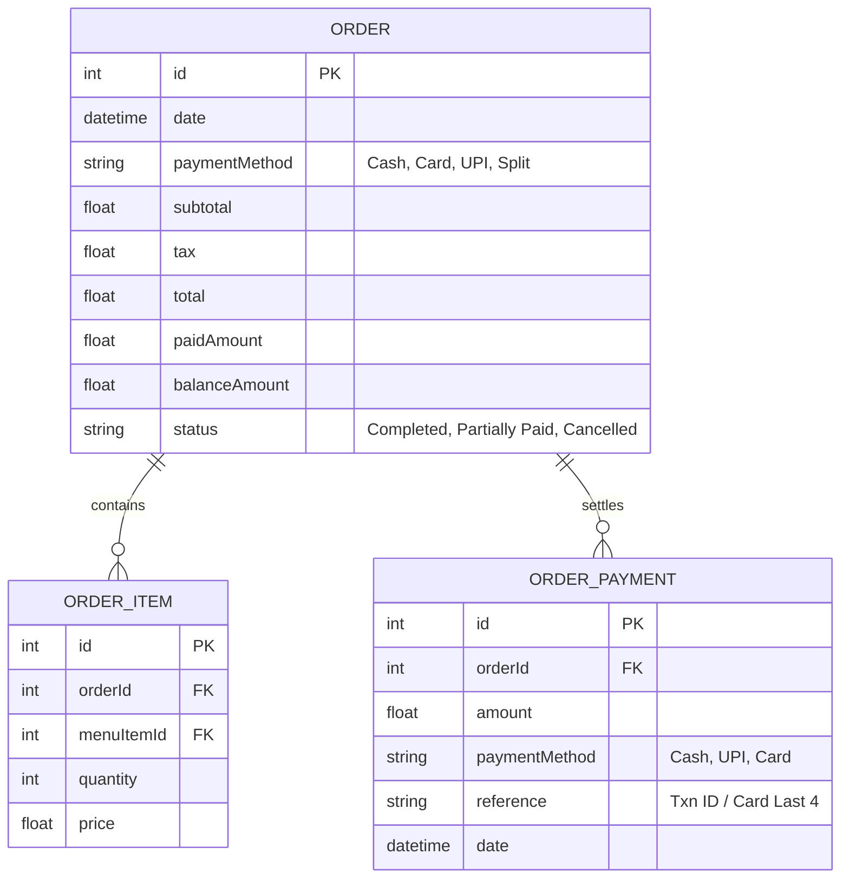
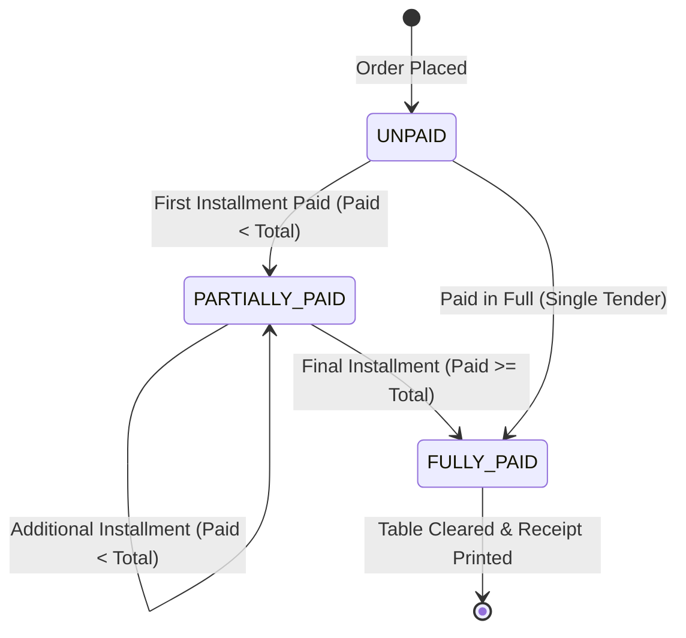

# Velora POS — Partial Payment & Split Settlement Feature Specification

## 1. Executive Summary
In high-volume Quick Service Restaurants (QSR) and dine-in cafes, modern billing expectations demand flexible settlement workflows. Customers routinely request:
1. **Split-Tender Payments**: Paying a single check using multiple payment methods (e.g., ₹400 in Cash and ₹600 via UPI).
2. **Multi-Party Split Billing**: Dividing a bill equally or unequally among guests at a table.
3. **Partial Advance Payments / Table Deposits**: Paying part of a running bill during an ongoing dining session, leaving an outstanding balance to be settled prior to departure.

The **Partial Payment Feature** provides an end-to-end ledger-backed payment engine across the Velora POS station node, NestJS backend, and MySQL database.

---

## 2. Core Functional Requirements

### 2.1 Multi-Tender Split Payment
- Cashiers can split a single ticket into multiple payment installments (e.g., Payment 1: Cash ₹300, Payment 2: Card ₹500, Payment 3: UPI ₹200).
- Real-time balance calculations dynamically display:
  $$\text{Balance Due} = \max(0, \text{Final Total} - \sum \text{Paid Installments})$$
- Once $\text{Balance Due} = 0$, the ticket can be settled and closed with `status = "Completed"`.

### 2.2 Table Partial Payments & Running Balance
- For dine-in tables, cashiers can record partial payments at any point during the meal.
- When an installment is accepted:
  - An `OrderPayment` audit record is stored.
  - The table remains **Occupied** with a distinct status badge: `Partially Paid`.
  - The Table Sidebar displays: `Due: ₹XXX (Paid: ₹YYY)`.
  - The cashier can add new items to the table order without losing track of previously paid deposits.

### 2.3 Quick Split Utilities
To accelerate cashier operations during peak rushes, the settlement modal provides 1-click split calculators:
- **Pay Remaining**: Fills the input with the exact remaining balance.
- **50% Split (2 Ways)**: Divides remaining balance by 2.
- **33.3% Split (3 Ways)**: Divides remaining balance by 3.
- **25% Split (4 Ways)**: Divides remaining balance by 4.

### 2.4 Void & Reversal of Installments
- Before final order closure, cashiers can remove/void any incorrectly entered payment installment with a single click.
- The balance due recalculates immediately.

---

## 3. Data Architecture & Database Models

### 3.1 Entity Relationship Diagram (ERD)



### 3.2 Prisma Schema Definition
```prisma
model Order {
  id            Int            @id @default(autoincrement())
  date          DateTime       @default(now())
  paymentMethod String         // Cash, Card, UPI, Split
  subtotal      Float
  tax           Float
  total         Float
  paidAmount    Float          @default(0)
  balanceAmount Float          @default(0)
  status        String         @default("Completed") // Completed, Partially Paid
  
  items         OrderItem[]
  payments      OrderPayment[]
}

model OrderPayment {
  id            Int      @id @default(autoincrement())
  orderId       Int
  order         Order    @relation(fields: [orderId], references: [id], onDelete: Cascade)
  amount        Float
  paymentMethod String   // Cash, Card, UPI
  reference     String?  // Optional: UTR / UPI Ref / Card Last 4
  date          DateTime @default(now())
}
```

---

## 4. Payment Lifecycle State Machine



| State | Description | Table Status | POS Sidebar Indicator |
| :--- | :--- | :--- | :--- |
| `UNPAID` | Running table with ordered items, 0 payments received. | `Dining` | Amber Badge `₹Total (Qty)` |
| `PARTIALLY_PAID` | Partial payment or advance deposited. Remaining balance $> 0$. | `Partially Paid` | Violet Badge `Due: ₹Bal (Paid: ₹Paid)` |
| `FULLY_PAID` | All installments equal or exceed total bill. | `Completed` | Table freed & inventory committed |

---

## 5. User Interface & Workflow Specification

### 5.1 Settlement Modal (`CheckoutModal.tsx`) Wireframe

```text
+-----------------------------------------------------------------------+
|  Settlement & Payment                                             [X]  |
|  Select settlement method and apply discounts                          |
+-----------------------------------------------------------------------+
|  [ Single Full Payment ]   [ Split / Partial Payment ]                |
|-----------------------------------------------------------------------|
|  BILL SUMMARY                 |  ADD PAYMENT INSTALLMENT              |
|  Subtotal:          ₹800.00   |  Amount to Pay (₹):                   |
|  Taxes & Charges:    ₹40.00   |  [ 420.00                           ] |
|  Discount:           ₹0.00    |                                       |
|  --------------------------   |  Quick Split:                         |
|  Final Total:       ₹840.00   |  [ Remaining ] [ 50% ] [ 33% ] [ 25% ] |
|  Total Paid:        ₹420.00   |                                       |
|  Remaining Due:     ₹420.00   |  Payment Method:                      |
|                               |  (•) Cash   ( ) UPI / QR   ( ) Card   |
|  PAYMENT LEDGER:              |                                       |
|  1. ₹420.00 (UPI) - 17:34 [x] |  [+ Add Payment Installment]          |
|                               |                                       |
|                               |---------------------------------------|
|                               |  [ Save Partial & Keep Table Open ]   |
|                               |  [ Confirm & Settle Order (Disabled) ]|
+-----------------------------------------------------------------------+
```

### 5.2 POS Table Sidebar Display (`POSTableSidebar.tsx`)
When a table has recorded partial payments:
- **Card Badge**: Displays `Partially Paid` in soft indigo/violet.
- **Metrics Line**: Shows:
  - **Due**: `₹420.00` (in bold amber)
  - **Paid**: `(Paid: ₹420.00)` (in muted text)
  - **Timer**: Active dining duration.

---

## 6. Thermal Receipt Printing Format
Thermal 80mm/58mm receipts format multi-tender settlements clearly:

```text
================================================
               VELORA CAFE & QSR
             Station #1 - Dine-In
================================================
Table: Couple A                     Order #1042
Date: 04/09/2026 17:45             Staff: Rajesh
------------------------------------------------
Item                   Qty    Price       Total
------------------------------------------------
Gulab Jamun             8     50.00      400.00
Barfi                   7     30.00      210.00
------------------------------------------------
Subtotal:                               ₹610.00
Taxes & GST (0%):                         ₹0.00
Discount:                                 ₹0.00
------------------------------------------------
NET TOTAL:                              ₹610.00
================================================
PAYMENT BREAKDOWN:
  • Cash:                               ₹300.00
  • UPI (Ref: 98472918):                ₹310.00
------------------------------------------------
TOTAL PAID:                             ₹610.00
BALANCE DUE:                              ₹0.00
================================================
     Thank you for visiting Velora Cafe!
```

---

## 7. Edge Cases & Safeguards

1. **Overpayment & Change Due**:
   - If the final cash installment exceeds the remaining balance due, the modal computes `Change Due = Tendered - RemainingDue` and logs the exact balance amount to `OrderPayment`.
2. **Concurrent Item Additions**:
   - If a customer orders another item after paying a partial deposit, the `Final Total` increments, increasing `Balance Due` automatically. The previous payment remains credited.
3. **Discount Application on Partial Payments**:
   - Discounts reduce the `Final Total`. The system ensures `Discount <= BaseTotal` and guards against negative balance.
4. **Table Transfers / Shift Table**:
   - When shifting an order from Table A to Table B, all associated `payments` and `savedOrders` migrate atomically to the destination table.
