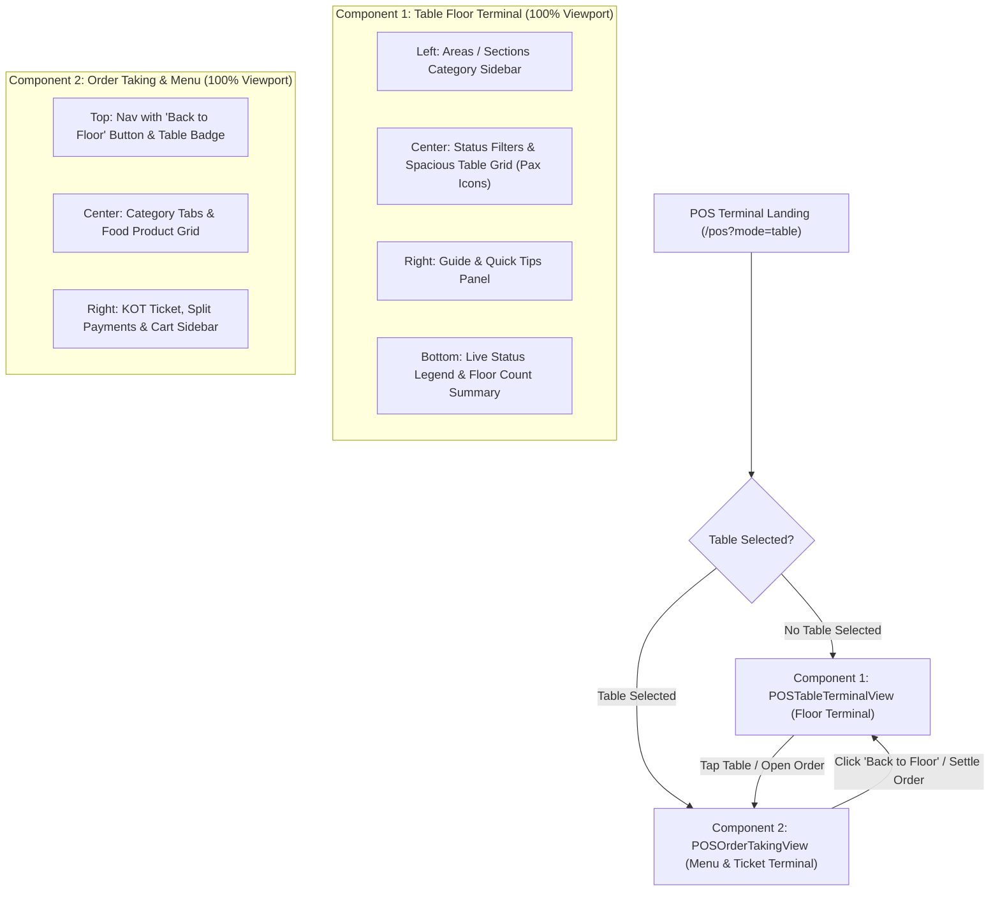

# Velora POS — Table Grid & Floor Terminal Feature Specification

---

## 1. Executive Summary & Purpose

The **Table Grid & Floor Terminal** is an enterprise-grade dine-in management interface for Quick Service Restaurants (QSR) and multi-section cafes. It provides floor managers, cashiers, and service staff with an immediate, real-time visual representation of all restaurant seating areas, live table occupancy, ongoing dining durations, table reservations, and housekeeping/cleaning statuses.

---

## 2. Architectural Evolution: Why We Transitioned from 3-Column Layout to Dedicated Components

### 2.1 The Legacy Layout (Figure 1: Crammed 3-Column Architecture)
In the initial implementation, the POS Table Service view attempted to render three major operational subsystems simultaneously on a single viewport:
1. **Left Column**: A narrow vertical list of tables (`POSTableSidebar`, ~280px–320px width).
2. **Center Column**: An idle placeholder ("Select a Dining Table") or the food catalog.
3. **Right Column**: The active ticket/cart sidebar (`POSCartSidebar`, ~380px–420px width).

```
┌───────────────────────────────────────────────────────────────────────────────┐
│ [Brand Logo] [POS Table Service]                 [Search]       [History]    │
├──────────────┬────────────────────────────────────────┬───────────────────────┤
│ Floor List   │ Center Operational Area                │ Current Ticket        │
│ (Crammed)    │                                        │ (Cart Sidebar)        │
│              │ "Select a Dining Table"                │                       │
│ • T1         │                                        │ Empty Cart            │
│ • T2         │ (Wasting >50% horizontal real estate   │ (Wasting >30% screen  │
│ • T3         │  before a table is even selected)      │  before items added)  │
│              │                                        │                       │
└──────────────┴────────────────────────────────────────┴───────────────────────┘
                               Figure 1: Legacy Layout
```

### 2.2 The Problem: Severe Spacing Constraints & Cognitive Overload
1. **Critical Spacing Deprivation**:
   - Compressing the restaurant's entire floor into a 280px left rail forced severe truncation of table names, section titles, and seat counts.
   - Cards lacked sufficient horizontal breathing room to display live dining timers, order amounts, and status indicators without visual chaos.
2. **Screen Real-Estate Wastage**:
   - Before a cashier taps a table, the center column displayed a large static illustration ("Select a Dining Table"), and the right column displayed an empty ticket ("Cart is empty").
   - Over **75% of the screen was completely idle and unutilized**, while the only interactive element—the table list—was suffocated in a tiny vertical rail.
3. **Ergonomic Friction on Touch Terminals & Tablets**:
   - On POS touch terminals, iPad registers, and Android tablets, 3 crowded vertical panes resulted in small, error-prone tap targets.
   - Waiters rushing during peak hours had difficulty differentiating between occupied, free, and reserved tables at a glance.
4. **Poor Multi-Area Scaling**:
   - Restaurants with multiple dining zones (e.g., Ground Floor, Rooftop, AC Hall, Garden Patio, Private Dining) had to cram area selectors into tiny dropdowns, preventing staff from assessing floor occupancy across sections at a glance.

---

### 2.3 The Solution: Dedicated Single Components (Figure 2: Component Separation)
To solve the spacing problem definitively, the user interface was decoupled into **two specialized, full-screen components**:



#### Key Benefits of the Redesign:
- **100% Screen Dedicated to Floor Operations**: The Table Terminal utilizes the full viewport for table discovery, status assessment, and floor navigation.
- **Visual Bird's-Eye Floor Plan**: Large, generous table cards with custom vector Pax seating illustrations (2, 4, 6, 8, 10+ pax), live elapsed timers (`⏱ 42 min`), and reservation tags (`📅 Res. 7:00 PM`).
- **Clear Navigation Separation**: Staff remain in the Table Terminal until a specific table is chosen, at which point the interface transitions cleanly into the Menu & Ticket terminal. A persistent **"← Floor / Tables"** back button ensures immediate return to the floor at any time.

---

## 3. UI Component Architecture & Design Specifications (Figure 2)

```
┌────────────────────────────────────────────────────────────────────────────────────────────────────────┐
│ [UB Logo] POS - Table Service [Table Mode]   [Search tables, areas... /]   [History] [● 365d] [🔔] [SK]│
├─────────────────┬──────────────────────────────────────────────────────────────┬───────────────────────┤
│ Areas/Sections  │ [All (12)] [Available (7)] [Occupied (4)] [Reserved (1)] ... │ [🍴] Select a Table   │
│                 ├──────────────────────────────────────────────────────────────┤                       │
│ • All Areas (12)│  ┌─────────┐   ┌─────────┐   ┌─────────┐   ┌─────────┐       │ Choose an available   │
│ • Ground Flr (6)│  │ T-01 ···│   │ T-02 ···│   │ T-03 ···│   │ T-04 ···│       │ table to start order. │
│ • Rooftop    (4)│  │  [Icon] │   │  [Icon] │   │  [Icon] │   │  [Icon] │       │                       │
│ • Private Rm (2)│  │  4 Pax  │   │  2 Pax  │   │ ⏱ 42min │   │  6 Pax  │       │ 💡 Quick Tips         │
│                 │  │Available│   │Available│   │Occupied │   │Available│       │ 1. Select area        │
│                 │  └─────────┘   └─────────┘   └─────────┘   └─────────┘       │ 2. Tap available table│
│                 │  ┌─────────┐   ┌─────────┐   ┌─────────┐   ┌─────────┐       │ 3. Add items from menu│
│                 │  │ T-05 ···│   │ T-06 ···│   │ T-07 ···│   │ T-08 ···│       │                       │
│                 │  │  [Icon] │   │  [Icon] │   │  [Icon] │   │  [Icon] │       │                       │
│                 │  │  4 Pax  │   │Res 7:00P│   │⏱ 1h 18m │   │  4 Pax  │       │                       │
│                 │  │Available│   │Reserved │   │Occupied │   │Available│       │                       │
│                 │  └─────────┘   └─────────┘   └─────────┘   └─────────┘       │                       │
├─────────────────┴──────────────────────────────────────────────────────────────┴───────────────────────┤
│ ● Available  ● Occupied  ● Reserved  ● Cleaning      Total Tables: 12 | Occupied: 4 | Available: 7 ... │
└────────────────────────────────────────────────────────────────────────────────────────────────────────┘
                                Figure 2: Modern Table Terminal Architecture
```

---

### 3.1 Top Navigation Bar (`POSTopNav`)
The top header provides critical station diagnostics and controls:
1. **Brand Identity Badge**: Cafe logo, business name, and outlet store code (e.g., `UB The Urban Bistro • CF-NAG-001`).
2. **Terminal Mode Indicator**: Pill badge denoting `Table Mode` or `Quick Mode`.
3. **Contextual Search Input**:
   - In Table Floor Mode: Search tables, area names, guest names, or seat numbers (shortcut: `/`).
   - In Order Taking Mode: Search food items, recipes, and beverages.
4. **Order History**: One-click drawer to inspect historical orders, reprint thermal bills, and review closed tickets.
5. **License Status Pill (Newly Added)**:
   - User requirement: *"in the fig 2. navbar does not contain Licence pill add this one"*.
   - Renders a live pulsating status pill: `● [Days Remaining] Days Left`.
   - Tooltip reveals licensed licensee and expiry date.
   - Clicking opens the interactive `PackageDetailsModal` detailing station limits, offline grace period, and active plan modules.
6. **Notification Bell Popover**:
   - Displays real-time badge count of unread store alerts.
   - Dropdown reveals low ingredient stock warnings, recent orders with amounts, and license expiry warnings.
   - Single-click "Mark all read" with localStorage persistence.
7. **Staff Profile Avatar & Dropdown**:
   - Displays staff initials (e.g., `SK`) and active role (`Store Manager`, `Cashier`).
   - Menu provides station locking, logout, quick mode switching, and floor setup shortcuts.

---

### 3.2 Areas & Sections Navigation Sidebar (Left Column)
- **Collapsible Section Rail**: Contains an accordion-style header with map icon and collapse toggle.
- **Section Items with Real-Time Table Counts**:
  - `All Areas` (Total count: e.g., 12 tables)
  - `Ground Floor` (e.g., 6 tables)
  - `Rooftop` (e.g., 4 tables)
  - `Private Room` (e.g., 2 tables)
- **Interactive Filtering**: Clicking any area filters the central table grid instantaneously, highlighting the active section with an amber accent.
- **Responsive Behavior**:
  - Desktop: Fixed vertical sidebar (width: 256px–280px).
  - Mobile/Phone: Automatically transforms into a horizontal scrollable pill bar at the top of the grid to prevent screen cramping.

---

### 3.3 Top Status Filter Strip (Center Header)
Located above the table cards grid, offering 1-click status filtering:
- **`All (12)`**: Displays all tables across the selected area.
- **`● Available (7)`**: Filters clean, vacant tables ready for immediate seating.
- **`● Occupied (4)`**: Filters tables with active guests and running orders.
- **`● Reserved (1)`**: Filters tables held for booked reservations.
- **`● Cleaning (0)`**: Filters tables undergoing turnover sanitization.
- **`Floor Plan Action`**: Action button on the right with grid icon linking directly to table layout management.

---

### 3.4 Scalable Pax Table Seating Icons (`TablePaxIcon`)
To provide immediate visual recognition of table capacity without requiring staff to read small numbers, custom vector seating graphics adapt dynamically based on seat capacity:

| Capacity | Seating Illustration Architecture | Visual Reference |
| :--- | :--- | :--- |
| **2 Pax** | Compact central table with **1 chair on left, 1 chair on right** | Fig 2: `T-02`, `T-09` |
| **4 Pax** | Square/rectangular dining table with **2 chairs on left, 2 chairs on right** | Fig 2: `T-01`, `T-05`, `T-08`, `T-12` |
| **6 Pax** | Elongated rectangular table with **3 chairs on left, 3 chairs on right** | Fig 2: `T-04`, `T-11` |
| **8 Pax** | Extended dining table with **4 chairs on left, 4 chairs on right** | Large family dining |
| **10+ Pax** | Grand banquet/conference dining table with **5+ chairs on each side** | Banquet hall & party rooms |

#### Dynamic Status-Driven Visual Styling:
- **Available**: Neutral slate/gray table and chairs (`#64748b`), clean card background, green status pill `● Available`, seat capacity badge (`4 Pax`).
- **Occupied**: Warm vibrant amber/orange (`#ea580c / #f97316`), warm peach card background (`#fff9f2`), dining plate accent, live elapsed duration timer (`⏱ 42 min`), orange status pill `● Occupied`.
- **Reserved**: Soft rose/red (`#e11d48 / #f43f5e`), soft pink card background (`#fff5f5`), calendar badge, reservation time display (`📅 Res. 7:00 PM`), red status pill `● Reserved`.
- **Cleaning**: Cool slate/cyan (`#0284c7`), subtle background tint, housekeeping sparkle icon, blue status pill `● Cleaning`.

---

### 3.5 Table Action Dropdown Menu (`•••`)
Each table card features a three-dots action trigger with context-sensitive operational actions:
- **For Available Tables**:
  - `Take Order / Open Table`: Immediately opens Menu & Ticket view.
  - `Reserve Table`: Opens `POSReserveTableModal` to book for a guest.
  - `Mark as Cleaning`: Flags the table as undergoing turnover.
  - `Edit Table Config`: Quick access to update name or seating capacity.
- **For Occupied Tables**:
  - `View / Add Items`: Opens running ticket in Menu view.
  - `Shift Table`: Opens `ShiftTableModal` to transfer guests and orders to another table.
  - `Print Bill`: Triggers thermal pre-settlement bill receipt.
  - `Clear / Reset Table`: Cancels or clears running session with confirmation.
- **For Reserved Tables**:
  - `Seat Guests & Start Order`: Transitions table to Occupied and opens Menu.
  - `Cancel Reservation`: Returns table to Available state.
  - `View Reservation Details`: Shows guest name, phone, reservation time, party size, notes.
- **For Cleaning Tables**:
  - `Mark as Cleaned / Available`: Returns table to ready state.

---

### 3.6 Right Guide Panel ("Select a Table" & Quick Tips)
On desktop screens, the right panel maintains orientation and training guidance:
- Warm rounded container with dining fork & knife emblem (`#fff4e5`).
- "Select a Table" header with instructional subtitle.
- **💡 Quick Tips Card**:
  1. *Select an area (optional)*: Filter by floor zone using the left sidebar.
  2. *Tap on an available table*: Open a vacant table to begin billing.
  3. *Start adding items from menu*: Transition seamlessly to food catalog.
- Automatically collapses on tablet and mobile viewports to prioritize table grid touch targets.

---

### 3.7 Bottom Status & Summary Bar
Fixed at the base of the terminal view:
- **Left**: Live color-coded legend:
  - `● Available` (Emerald)
  - `● Occupied` (Amber)
  - `● Reserved` (Rose)
  - `● Cleaning` (Slate)
- **Right**: Floor statistics telemetry:
  - `Total Tables: 12 | Occupied: 4 | Available: 7 | Reserved: 1 | Cleaning: 0`

---

## 4. Multi-Device Responsiveness (Desktop, Tablet, Mobile)

| Device Tier | Viewport Width | Layout Adaptations |
| :--- | :--- | :--- |
| **Desktop / POS Stations** | $\ge 1280\text{ px}$ | Full 3-column floor layout: Left Areas Sidebar (260px), 4-column Table Grid, Right Quick Tips Panel (300px), Bottom Summary Bar. |
| **Laptops & Compact POS** | $1024\text{ px} - 1279\text{ px}$ | Compact 3-column Table Grid, collapsible Areas Sidebar, Guide panel toggled off to optimize table touch targets. |
| **Tablets / iPads** | $768\text{ px} - 1023\text{ px}$ | 2-3 column Table Grid with enlarged touch cards. Collapsible left sidebar drawer. Mobile cart slide-up drawer when taking orders. |
| **Mobile Phones / Handhelds** | $< 768\text{ px}$ | Areas bar converts to horizontal scrollable top chips. 1-2 column touch-friendly table cards. Floating bottom order summary pill bar. |

---

## 5. State Management & Local Storage Persistence

To guarantee zero data loss across browser reloads or station reboots, table states are synchronized across memory and `localStorage`:

| State Key | Storage Key | Data Structure | Purpose |
| :--- | :--- | :--- | :--- |
| `tableOrders` | `pos_table_orders` | `Record<string, TableOrderState>` | Holds running KOT batches, active cart items, kitchen instructions. |
| `tableStartTimes` | `pos_table_start_times` | `Record<string, number>` | Epoch timestamp when dining began for calculating live duration (`⏱ 42 min`). |
| `tableReservations` | `pos_table_reservations` | `Record<string, ReservationData>` | Guest name, contact phone, reservation time, party size, notes. |
| `tableCleaningStatus` | `pos_table_cleaning` | `Record<string, boolean>` | Flags tables undergoing housekeeping. |
| `tablePrinted` | `pos_table_printed` | `Record<string, boolean>` | Flags tables that have received a pre-bill printout. |

---

## 6. Table Grid Refinements & Layout Enhancements

Based on operational feedback on the live terminal screen:
1. **Removed Non-Operational Buttons**:
   - Removed the "Floor Management" footer button in the Areas sidebar.
   - Removed the "Floor Plan" shortcut button in the center top status bar to eliminate redundant floor configuration pathways during active billing.
2. **Extra Table Card (Scrollable Grid)**:
   - Added an "Extra Table" dashed action card inside the table cards grid. Clicking this card opens the temporary table modal (`AddTablePOSModal`), allowing floor captains to instantly add ad-hoc seating during rush hours.
3. **Collapsible Areas / Sections Sidebar**:
   - Added an interactive collapse button (`ChevronLeft` / `ChevronRight`) allowing staff to minimize the left sections sidebar to an ultra-compact icon rail (`w-12 lg:w-14`).
   - State is persisted across browser reloads via `pos_table_areas_collapsed` in `localStorage`.
   - When collapsed, horizontal space is maximized, displaying **5 tables per row on desktop** (`xl:grid-cols-5`), **4 on tablet** (`lg:grid-cols-4 md:grid-cols-3`), and **2 on mobile** (`grid-cols-2`).
4. **User Profile Dropdown Streamlining (`POSTopNav`)**:
   - Cleaned up top-right owner profile dropdown (Yash Jais, OWNER):
     - Removed obsolete links: "Floor Plan Setup" and "Switch to Quick POS".
     - Preserved: User Name, Active Online status badge with pulsing emerald indicator, Role, and "Lock / Log Out".
     - Added dedicated links:
       - **Store & Owner Profile**: Opens the full `StoreProfileModal` showing cafe details, contact info, and GSTIN.
       - **Store Settings**: Direct link to `/settings` for printer, station nodes, and tax configs.

---

## 7. Next Step: Menu Page Redesign Preparation
With the Table Grid & Floor Terminal architecture finalized:
- This document serves as the permanent reference for all floor management and table grid behaviors.
- Once table terminal implementation and documentation are verified, the user will upload the design image for the **Menu Page Redesign** to commence the next phase.

