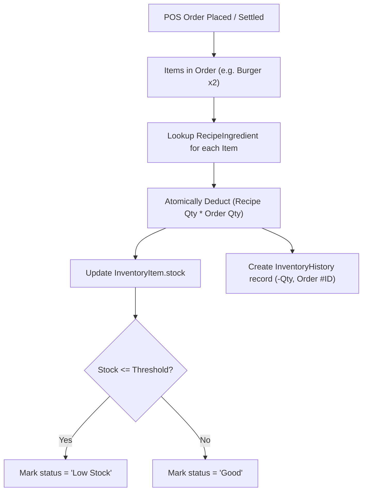

# 📦 Stock Summary & Inventory Linkage Report Documentation

## 1. Overview & Purpose
The **Stock Summary & Inventory Linkage** system tracks raw material consumption driven by POS order fulfillment. Every menu dish sold triggers an automated, recipe-based deduction of raw ingredients from the local inventory ledger.

---

## 2. Recipe-Linked Stock Deduction Flow

---

## 3. Key Inventory Metrics

| Field | Description |
| :--- | :--- |
| **Item Name** | Name of raw material / stock ingredient (e.g., *Burger Buns*, *Coffee Beans*) |
| **Current Stock** | Live remaining stock quantity in specified units (`pcs`, `kg`, `L`) |
| **Safety Threshold** | Minimum buffer before replenishment alerts trigger |
| **Stock Health** | Dynamic status indicator (`Good`, `Low Stock`, `Out of Stock`) |
| **Audit Ledger** | Immutable history log of additions (restock) and order deductions |

---

## 4. Viewing Stock Movement & History

From the **Inventory** (`/inventory`) management tab:
1. **Live Stock Table**: Lists all raw ingredients with health indicators and quick restock actions.
2. **Audit History Modal**: Displays all historical additions and deductions for each ingredient, timestamped with the associated POS Order reference.
